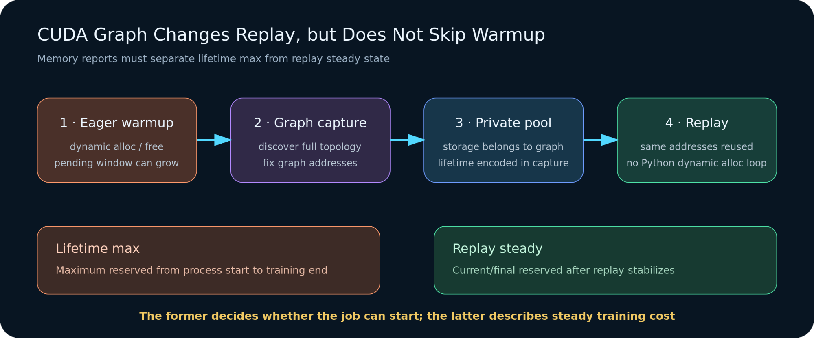
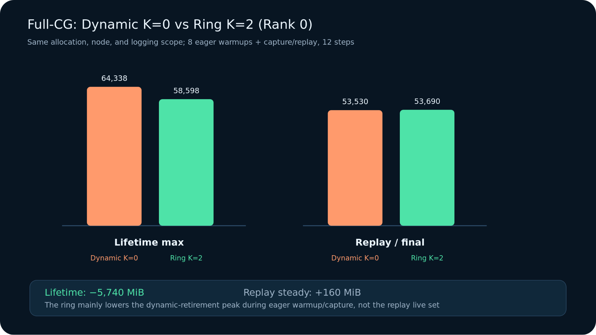
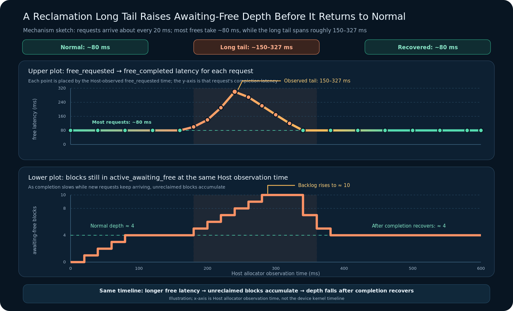

# Cross-Stream GPU Memory Reuse

Reproduction material for the technical article *Why Does Cross-Stream GPU
Memory Keep Growing?* The experiment isolates a one-way CUDA stream lifetime:
a producer publishes a tensor, a consumer reads it on another stream, and the
Host can enqueue new producer work before the consumer retires.

The repository compares five safe lifetime strategies and one intentionally
unsafe control:

- same-stream ordering;
- cross-stream use protected by `Tensor.record_stream()`;
- `record_stream()` plus a Host synchronization on every iteration;
- creation-stream hand-back with a consumer-to-producer CUDA event;
- an event-managed preallocated slot pool;
- an unsafe cross-stream control used only to verify the race detector.

## Repository contents

```text
.
├── data/
│   ├── evidence.json                 # Numbers used by the article
│   └── microbenchmark_5x_summary.csv # Published five-run summary
├── figures/
│   ├── part1-en/ and part1-zh/       # Publication figures for Part 1
│   ├── part2-en/ and part2-zh/       # Publication figures for Part 2
│   ├── cuda_graph_phases.png          # Warmup, capture, and replay semantics
│   ├── full_cg_lifetime_vs_replay.png # Startup high-water vs. replay steady state
│   ├── microbenchmark_tradeoff.svg    # Rebuilt from the published CSV
│   └── release_latency_tail.png       # Schematic of the observed release tail
└── scripts/
    ├── experiments/
    │   └── linear_inflight_memory.py # CUDA microbenchmark and snapshot export
    ├── plot_microbenchmark.py        # Dependency-free SVG renderer
    └── summarize_results.py          # JSONL-to-CSV aggregation
```

## Requirements

- Linux with an NVIDIA GPU
- Python 3.10 or newer
- CUDA-enabled PyTorch
- enough free GPU memory for the selected shape

The published H100 measurements used PyTorch
`2.11.0a0+a6c236b9fd.nv26.03.46836102` and CUDA 13.2. The default input shape
is `[32768, 8192]` in BF16, or 512 MiB per iteration. The `record_stream()`
case can retain roughly 22 GiB of pending-free storage, so use a smaller shape
for a smoke test on a lower-memory GPU.

Install PyTorch using the command appropriate for your CUDA environment. No
third-party package is required by the aggregation or plotting scripts.

## Reproduce the five safe cases

The unsafe case also runs as a negative control but is excluded from the safe
summary by default.

```bash
python scripts/experiments/linear_inflight_memory.py \
  --m 32768 --k 8192 --iters 52 --repeat 5 \
  --extended-matrix --ring-slots 1 \
  --jsonl-output one_way_five_safe_cases_5x.jsonl

python scripts/summarize_results.py \
  one_way_five_safe_cases_5x.jsonl \
  --output microbenchmark_5x_summary.csv

python scripts/plot_microbenchmark.py \
  microbenchmark_5x_summary.csv \
  --output microbenchmark_tradeoff.svg
```

For a lower-memory smoke test:

```bash
python scripts/experiments/linear_inflight_memory.py \
  --m 4096 --k 2048 --n 128 --iters 8 --repeat 1 \
  --consumer-delay-dim 1024 --consumer-delay-repeats 2 \
  --extended-matrix --ring-slots 1 \
  --jsonl-output smoke.jsonl
```

The smaller case checks that the program runs, but it may not create a deep
enough consumer backlog to reproduce the published pending-free magnitude or
make the unsafe race deterministic.

## Capture Memory Snapshots

Record the `record_stream()` path:

```bash
python scripts/experiments/linear_inflight_memory.py \
  --case --stream-mode cross --m 32768 --k 8192 --iters 52 \
  --nvtx --record-memory-history \
  --snapshot-path cross_record_stream.pickle
```

Record the creation-stream hand-back path:

```bash
python scripts/experiments/linear_inflight_memory.py \
  --case --stream-mode handback --m 32768 --k 8192 --iters 52 \
  --nvtx --record-memory-history \
  --snapshot-path handback.pickle
```

Snapshot files are generated locally rather than committed: they can be large
and can contain local Python source paths in recorded stack frames. Inspect
them with the PyTorch Memory Snapshot viewer or another compatible tool.

## Reading the result

The key comparison is not `allocated_peak_mib` alone. Inspect these fields
together:

- `active_awaiting_free_mib`: storage whose Python reference is gone but whose
  side-stream consumer has not yet retired;
- `reserved_peak_mib`: the allocator high-water mark;
- `completed_before_final_sync`: how far the GPU progressed while the Host was
  enqueueing work;
- `cpu_enqueue_s` versus `wall_s`: whether the Host remained ahead of the GPU;
- `output_correct` and `output_max_abs_error`: the numerical safety check.

The checked-in `data/evidence.json` also contains the production-training,
slot-pool, CUDA Graph, and long-tail values cited by the article. Those results
require the corresponding Megatron-LM environment and are included as
structured evidence, not as a claim that this standalone microbenchmark can
reproduce a full training run.

## CUDA Graph: why replay does not repeat eager allocation

Full-iteration CUDA Graph has three memory phases that should not be mixed:

1. **Eager warmup** uses the global allocator and still follows normal Python
   allocation/free and cross-stream retirement.
2. **Capture** fixes the addresses used by operators and builds a graph-private
   pool. Cross-stream blocks can still raise the startup high-water while the
   graph is being captured.
3. **Replay** executes the captured DAG with the same addresses. It does not
   rerun the eager Python allocation/free path on every iteration, so it does
   not recreate the same pending-free window repeatedly.



The [NVIDIA CUDA Graph Memory Issues
guide](https://docs.nvidia.com/dl-cuda-graph/latest/troubleshooting/memory-issues.html)
explains why captured operators keep using fixed addresses during replay. That
property is separate from recycling blocks *during capture*.
`graph_capture_record_stream_reuse` is an experimental PyTorch allocator option
for the latter problem: it uses capture-DAG topology to decide when streams
have joined and a block can be reused. Explicit creation-stream hand-back is
another way to make the join visible before release. In either case, the job
must first survive warmup and capture before reaching steady replay.

The Full-CG comparison used a full-width DeepSeek-V3 8-layer/16-expert proxy,
TP1/PP1/EP4/DOI4, 16 GB200 GPUs, micro-batch size 1, global batch size 512, and
eight eager warmup steps followed by capture/replay. The only variable was
dynamic dispatch output (`K=0`) versus two preallocated dispatch slots (`K=2`).



`K=2` lowered the lifetime maximum across warmup, capture, and replay by
5,740 MiB. It did **not** save 5.7 GiB on every replay step. During replay, both
cases used captured addresses and had nearly identical reserved memory; the
two persistent slots left the final `K=2` value 160 MiB higher. The benefit was
a lower transient startup high-water, not an equal reduction in steady live
tensor memory.

## Long-tail release latency

The MBS2 Memory Snapshot showed a separate timing pattern:

- allocation requests continued every 19–20 ms;
- `alloc → free_requested` remained stable;
- most `free_requested → free_completed` intervals were about 80 ms, while a
  long-tail window ranged from roughly 150 to 327 ms;
- a roughly 200 ms completion pause increased in-flight pending depth from
  about 4 blocks to about 10, after which the backlog drained toward 4 again.



This figure is a mechanism sketch derived from the measured summary, not the
real allocation order. Its horizontal axis is Host allocator observation time,
not a device-kernel timeline. It shows that long-tail completion and increased
pending depth occurred together; it does not prove that one tail request alone
created ten pending blocks or identify the delayed stage.

| Candidate stage | Evidence required for confirmation |
| --- | --- |
| Compute or consumer-stream backlog | Consumer-kernel completion time in Nsys |
| HybridEP, A2A, NCCL, or fabric straggler | Collective and transport timelines |
| Communication progress-thread jitter | OS runtime and progress-thread trace |
| Allocator observes completion late | Consumer completed before `free_completed`; confirm the next allocator poll |

A conclusive attribution requires NVTX markers, memory history, and an Nsys
`cuda,nvtx,osrt` trace from the same rank. With the current evidence, the
precise statement is that a local release-latency tail occurred. It is not yet
a demonstrated Python CPU-jitter problem, transport root cause, or
cross-iteration memory leak.

## References

- [PyTorch `Tensor.record_stream()`](https://pytorch.org/docs/stable/generated/torch.Tensor.record_stream.html)
- [PyTorch CUDA memory statistics](https://pytorch.org/docs/stable/generated/torch.cuda.memory.memory_stats.html)
- [Understanding CUDA Memory Usage](https://pytorch.org/docs/stable/torch_cuda_memory.html)
- [NVIDIA CUDA Graph Memory Issues](https://docs.nvidia.com/dl-cuda-graph/latest/troubleshooting/memory-issues.html)
- [Megatron-LM PR #7062](https://github.com/NVIDIA/Megatron-LM/pull/7062)
